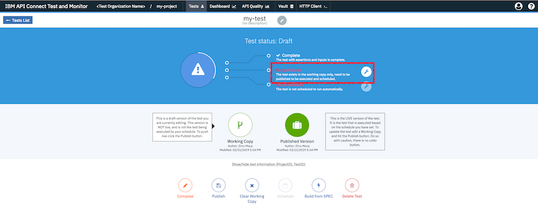
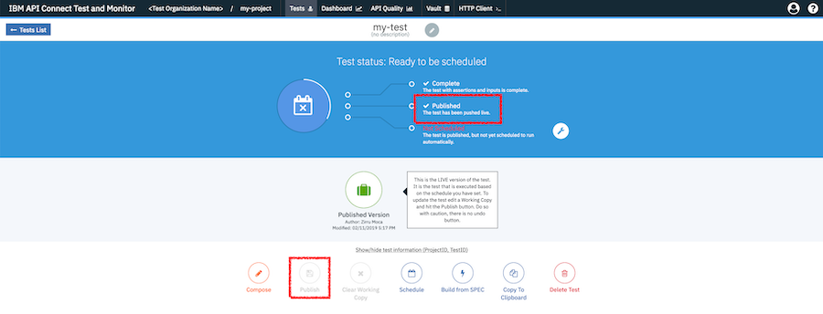

# Publishing a test

After you have completed the configuration of your test, and run it manually to confirm that it works correctly, you can publish the test. You need to publish a test to be able to schedule it to run automatically.  
  
After you have published a test, you can continue to work on the test in the Composer without affecting the published test, and then publish the test again later to update the published test.  
  
To publish a test, complete the following steps:

1. Click your project name in the menu bar to get to the "Projects" page.

    

1. On the "Projects" page, click the **Tests** icon  for the project that contains the test that you want to publish. The list of tests is displayed.

1. From the list of tests double-click the test that you want to publish, or click the **edit** icon  for the test. 

1. The status page for your test is displayed. If your test has not been published before, the status will show as **Not published**.

    

1. Click the **Publish** icon  to publish your test.

1. The test status page is updated with the following changes:
- The status of the test now shows as **Published**.
- The **Publish** icon is disabled.

    

# What to do next

- Next topic: [Scheduling a test](Schedule-test.md)

- Previous topic: [Running a test](Run-test.md)
